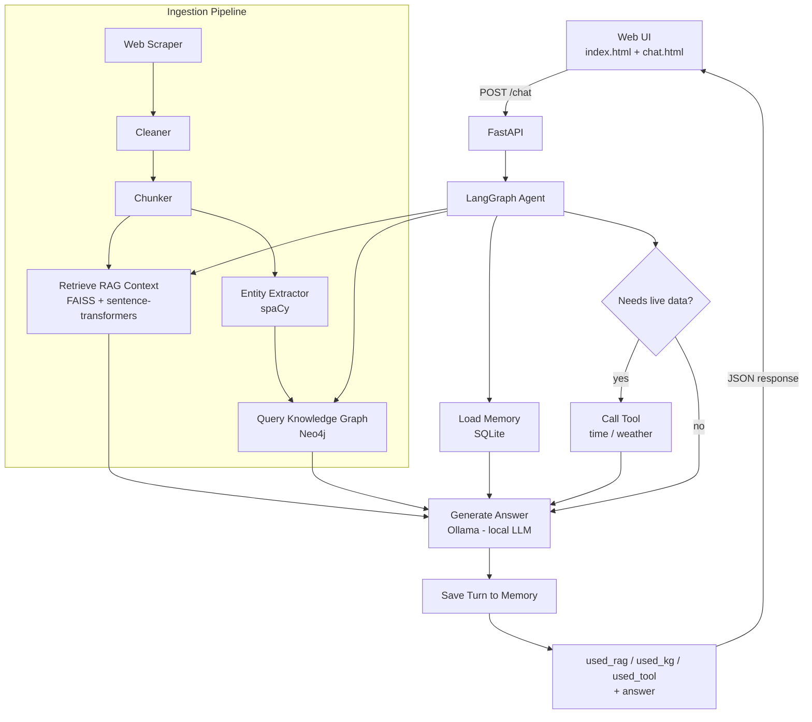

# 🧠 Memory-Augmented Chatbot

**RAG + Knowledge Graph + Long-Term Memory + LangGraph Agent — built entirely with free, local tools.**

A context-aware, personalized chatbot system that combines static knowledge
retrieval (RAG), structured reasoning (a knowledge graph), long-term user
memory, and dynamic real-time tools, orchestrated by a LangGraph agent and
measured by a custom evaluation framework.


---

## Table of Contents

- [Overview](#overview)
- [Architecture](#architecture)
- [Web Interface](#web-interface)
- [Tech Stack](#tech-stack)
- [Project Structure](#project-structure)
- [Quick Start](#quick-start)
- [Detailed Setup Per Phase](#detailed-setup-per-phase)
- [Evaluation Results](#evaluation-results)
- [Design Decisions](#design-decisions)
- [Known Limitations](#known-limitations)
- [License](#license)

---

## Overview

This project implements a full memory-augmented chatbot pipeline in 8 phases:

| Phase | Component | Purpose |
|-------|-----------|---------|
| 1 | **Data Ingestion** | Scrape → clean → chunk web content into retrievable pieces |
| 2 | **RAG** | Embed chunks locally, retrieve relevant context via FAISS vector search |
| 3 | **Knowledge Graph** | Extract entities/relationships, store as a queryable graph in Neo4j |
| 4 | **Long-Term Memory** | Persist user preferences + conversation history (SQLite) |
| 5 | **LangGraph Agent** | Orchestrate RAG + KG + memory + live tools, generate responses |
| 6 | **Evaluation** | Score context relevance, answer relevance, and faithfulness |
| 7 | **API Layer** | Expose everything via FastAPI |
| 8 | **Web Interface** | A landing page + live chat console, served by the API itself |

**Every phase runs entirely free and mostly offline** — no OpenAI billing,
no paid cloud services required. See [Design Decisions](#design-decisions)
for why, and what a production version might swap in instead.

## Architecture



The web UI isn't just a chat box — the `/chat` endpoint reports back *which*
subsystems actually contributed to each answer (`used_rag`, `used_kg`,
`used_tool`), and the frontend visualizes that live as a status panel. See
[Web Interface](#web-interface) below.

## Web Interface

A static frontend (plain HTML/CSS/JS, no build step) lives in `web/` and is
served directly by the FastAPI app at `/ui`.

| Page | Path | What it does |
|------|------|----------------|
| Landing page | `/ui/index.html` | Project overview, architecture diagram, tech stack, evaluation results |
| Live chat | `/ui/chat.html` | A working chat console wired to the real `/chat` endpoint |

**The chat page's signature feature: real-time subsystem indicators.** Next
to the conversation, a small panel shows four nodes — `MEMORY`, `RAG INDEX`,
`KNOWLEDGE GRAPH`, `LIVE TOOLS` — that light up based on the actual
`used_rag` / `used_kg` / `used_tool` flags returned by the API for that
specific answer. It's a direct visualization of the LangGraph routing
decision, not a decorative animation.

To use it, start the API and open the chat page in a browser:
```bash
uvicorn app.api.main:app --reload
```
Then visit `http://127.0.0.1:8000/ui/chat.html` (landing page at
`http://127.0.0.1:8000/ui/index.html`).

## Tech Stack

| Layer | Technology | Why |
|-------|-----------|-----|
| Scraping | `requests` + `BeautifulSoup` | Simple, reliable HTML extraction |
| Chunking | `langchain-text-splitters` | Battle-tested recursive chunking |
| Embeddings | `sentence-transformers` (`all-MiniLM-L6-v2`) | Free, local, no API key |
| Vector store | `FAISS` | Fast, free, in-process similarity search |
| Entity extraction | `spaCy` (dependency parsing) | Free, offline NER + relation extraction |
| Knowledge graph | `Neo4j` (AuraDB free tier) | Purpose-built graph database + Cypher queries |
| Memory | `SQLite` | Zero-setup persistent storage |
| Orchestration | `LangGraph` | Explicit, inspectable agent state machine |
| Generation | `Ollama` (`gemma2:2b`) | Fully local LLM, no API key or quota |
| Evaluation | Custom (cosine similarity + LLM-judge) | Free alternative to RAGAS |
| API | `FastAPI` | Async, auto-documented, production-ready |
| Frontend | Plain HTML/CSS/JS | No build step, served directly by FastAPI |

## Project Structure

```
memchat/
├── app/
│   ├── config.py              # centralized settings (reads .env)
│   ├── ingestion/              # Phase 1: scrape → clean → chunk
│   │   ├── scraper.py
│   │   ├── cleaner.py
│   │   ├── chunker.py
│   │   └── run_pipeline.py
│   ├── rag/                     # Phase 2: embeddings + FAISS retrieval
│   │   ├── embedder.py
│   │   ├── vectorstore.py
│   │   ├── build_index.py
│   │   └── retriever.py
│   ├── graph/                    # Phase 3: entity extraction + Neo4j
│   │   ├── extractor.py
│   │   ├── neo4j_client.py
│   │   ├── build_graph.py
│   │   └── query_graph.py
│   ├── memory/                    # Phase 4: SQLite long-term memory
│   │   ├── db.py
│   │   ├── memory_store.py
│   │   └── demo.py
│   ├── agent/                      # Phase 5: LangGraph orchestration
│   │   ├── state.py
│   │   ├── tools.py
│   │   ├── llm.py
│   │   ├── build_agent.py
│   │   └── chat.py
│   ├── eval/                        # Phase 6: evaluation framework
│   │   ├── metrics.py
│   │   ├── test_set.py
│   │   └── run_eval.py
│   └── api/                          # Phase 7: FastAPI web layer
│       ├── main.py
│       └── schemas.py
├── web/                     # Phase 8: static frontend (served by FastAPI)
│   ├── index.html           # landing page: overview, architecture, eval results
│   ├── chat.html             # live chat console + subsystem status panel
│   ├── style.css              # shared blueprint/schematic design system
│   └── script.js               # chat logic, talks to /chat
├── data/                    # generated at runtime (gitignored)
│   ├── raw/                 # scraped JSON
│   ├── processed/           # cleaned + chunked text
│   └── vectorstore/         # FAISS index + metadata
├── requirements.txt
├── .env.example
└── urls_example.txt
```

## Quick Start

```bash
# 1. Clone and enter the project
git clone <your-repo-url>
cd memchat

# 2. Set up the environment
python -m venv venv
source venv/bin/activate        # Windows: venv\Scripts\activate
pip install --upgrade pip
pip install -r requirements.txt

# 3. Configure secrets
cp .env.example .env
# fill in NEO4J_URI / NEO4J_USERNAME / NEO4J_PASSWORD (free AuraDB instance)

# 4. Install local models (one-time)
python -m spacy download en_core_web_sm
ollama pull gemma2:2b     # requires Ollama: https://ollama.com/download

# 5. Run the full pipeline
python -m app.ingestion.run_pipeline --urls urls_example.txt
python -m app.rag.build_index
python -m app.graph.build_graph
python -m app.eval.run_eval

# 6. Chat with it
python -m app.agent.chat

# 7. Or serve it as an API + web UI
uvicorn app.api.main:app --reload
# then open http://127.0.0.1:8000/ui/chat.html  (live chat interface)
#       or  http://127.0.0.1:8000/ui/index.html (project overview)
#       or  http://127.0.0.1:8000/docs           (raw API docs)
```

## Detailed Setup Per Phase

<details>
<summary><strong>Phase 1 — Data Ingestion Pipeline</strong></summary>

Put one URL per line in a text file (see `urls_example.txt`), then:
```bash
python -m app.ingestion.run_pipeline --urls urls_example.txt
```
Produces `data/raw/*.json` → `data/processed/cleaned.jsonl` → `data/processed/chunks.jsonl`.
Each step (`scraper.py`, `cleaner.py`, `chunker.py`) can also be run individually.
</details>

<details>
<summary><strong>Phase 2 — RAG (Embeddings + Vector Search)</strong></summary>

Uses a local embedding model (`all-MiniLM-L6-v2`, downloaded once, then offline).

```bash
python -m app.rag.build_index
python -m app.rag.retriever "What is retrieval-augmented generation?"
```
</details>

<details>
<summary><strong>Phase 3 — Knowledge Graph (spaCy + Neo4j)</strong></summary>

Requires a free [Neo4j AuraDB](https://neo4j.com/cloud/aura/) instance —
set `NEO4J_URI` / `NEO4J_USERNAME` / `NEO4J_PASSWORD` in `.env`.

```bash
python -m spacy download en_core_web_sm
python -m app.graph.build_graph          # add --limit 1 to test small first
python -m app.graph.query_graph "RAG"
```
</details>

<details>
<summary><strong>Phase 4 — Long-Term Memory (SQLite)</strong></summary>

No setup needed — SQLite is part of Python's standard library.

```bash
python -m app.memory.demo
```
Stores preferences + conversation history in `data/memory.db`.
</details>

<details>
<summary><strong>Phase 5 — LangGraph Agent (RAG + KG + Memory + Tools)</strong></summary>

Requires [Ollama](https://ollama.com/download) installed and running.

```bash
ollama pull gemma2:2b
python -m app.agent.chat
```
The agent routes between RAG, the knowledge graph, and live tools
(current time, weather via wttr.in) based on the query, then generates a
response with a local LLM and saves the turn to memory.
</details>

<details>
<summary><strong>Phase 6 — Evaluation Framework</strong></summary>

```bash
python -m app.eval.run_eval
```
Scores every question in `app/eval/test_set.py` on:
- **Context relevance** (cosine similarity, question ↔ retrieved chunks)
- **Answer relevance** (cosine similarity, question ↔ answer)
- **Faithfulness** (local LLM-as-judge: is the answer grounded in context?)

Full results saved to `data/eval_results.json`.
</details>

<details>
<summary><strong>Phase 7 — API Layer (FastAPI)</strong></summary>

```bash
uvicorn app.api.main:app --reload
```
Open `http://127.0.0.1:8000/docs` for interactive API documentation.

| Method | Path | Description |
|--------|------|--------------|
| GET | `/health` | Liveness check |
| POST | `/chat` | `{user_id, query}` → `{answer}` (runs the full pipeline) |
| GET | `/memory/{user_id}` | Inspect stored preferences + history |
| GET | `/rag/search?q=...` | Raw RAG retrieval results |
| GET | `/kg/search?entity=...` | Raw knowledge graph query |
</details>

<details>
<summary><strong>Phase 8 — Web Interface</strong></summary>

Static frontend, no build step, served directly by FastAPI at `/ui`.

```bash
uvicorn app.api.main:app --reload
```
- `http://127.0.0.1:8000/ui/index.html` — landing page (overview, architecture, eval results)
- `http://127.0.0.1:8000/ui/chat.html` — live chat console

The chat page's status panel (`MEMORY` / `RAG INDEX` / `KNOWLEDGE GRAPH` /
`LIVE TOOLS`) lights up based on the real `used_rag` / `used_kg` /
`used_tool` flags the `/chat` endpoint returns for each answer — it's a
live view into the LangGraph routing decision, not a static mockup.
</details>

## Evaluation Results

Example run on the sample dataset (2 Wikipedia articles on RAG and
knowledge graphs), evaluated with a local `gemma2:2b` model:

| Metric | Score | What it means |
|--------|-------|----------------|
| Context relevance | ~0.46 | Retriever finds moderately related chunks |
| Answer relevance | ~0.73 | Answers stay on-topic for the question asked |
| Faithfulness | ~0.52 | About half the answers are fully grounded in retrieved context |

*(Run `python -m app.eval.run_eval` to reproduce on your own data.)*

## Design Decisions

This build deliberately swaps a few components from the original spec for
**zero-cost, easy-to-run alternatives**, documented here for transparency:

- **SQLite instead of MongoDB/Postgres** for long-term memory — same
  purpose, no server or account to manage. Swapping in a different store
  only requires changing `app/memory/db.py`.
- **spaCy dependency parsing instead of an LLM** for entity/relationship
  extraction — free and offline, at the cost of some precision (an LLM
  extractor would catch more nuanced relationships).
- **Ollama instead of a hosted LLM API** for response generation — no
  billing or quota limits, running small open models locally.

## Known Limitations

- Small local models (`gemma2:2b`) occasionally blend retrieved facts with
  their own training knowledge rather than staying strictly grounded —
  reflected in the faithfulness score above.
- The web-scraping cleaner doesn't fully strip citation/reference-list
  sections from Wikipedia-style pages, slightly diluting retrieval quality.
- spaCy-based extraction produces noisier entities than an LLM would
  (e.g. stray section numbers occasionally get treated as entities).

These are documented tradeoffs of the free/local approach, not open bugs —
each is described alongside its cheap production alternative above.

## License

MIT — see [LICENSE](LICENSE).
